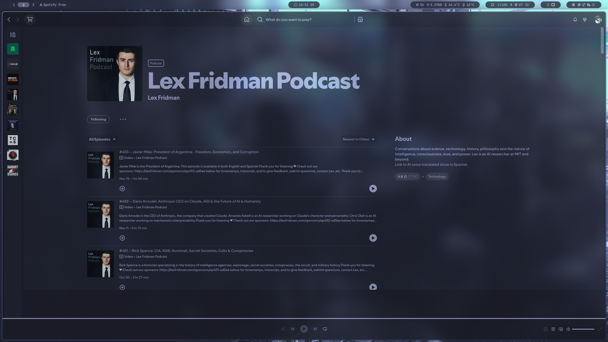

# Arch Linux Dotfiles

This repository contains my personal configuration files (dotfiles) for Arch Linux. These configurations are tailored to enhance productivity and aesthetics on my system.

## Images




## .config

- [btop](config/btop/)
  - [themes](config/btop/themes/)
- [hyde](config/hyde/)
  - [disabled_wallbash](config/hyde/disabled_wallbash/)
    - [Wall-Dcol](config/hyde/disabled_wallbash/Wall-Dcol/)
      - [gtk](config/hyde/disabled_wallbash/Wall-Dcol/gtk/)
      - [kvantum](config/hyde/disabled_wallbash/Wall-Dcol/kvantum/)
    - [Wall-Ways](config/hyde/disabled_wallbash/Wall-Ways/)
      - [notification](config/hyde/disabled_wallbash/Wall-Ways/notification/)
      - [palette](config/hyde/disabled_wallbash/Wall-Ways/palette/)
  - [themes](config/hyde/themes/)
    - [Catppuccin Latte](config/hyde/themes/Catppuccin%20Latte/)
    - [Catppuccin Mocha](config/hyde/themes/Catppuccin%20Mocha/)
    - [Decay Green](config/hyde/themes/Decay%20Green/)
    - [Edge Runner](config/hyde/themes/Edge%20Runner/)
    - [Frosted Glass](config/hyde/themes/Frosted%20Glass/)
    - [Graphite Mono](config/hyde/themes/Graphite%20Mono/)
    - [Gruvbox Retro](config/hyde/themes/Gruvbox%20Retro/)
    - [Material Sakura](config/hyde/themes/Material%20Sakura/)
    - [Nordic Blue](config/hyde/themes/Nordic%20Blue/)
    - [Rosé Pine](config/hyde/themes/Rosé%20Pine/)
    - [Synth Wave](config/hyde/themes/Synth%20Wave/)
    - [Tokyo Night](config/hyde/themes/Tokyo%20Night/)
- [hypr](config/hypr/)
  - [change](config/hypr/change/)
  - [mako](config/hypr/mako/)
    - [icons](config/hypr/mako/icons/)
  - [scripts](config/hypr/scripts/)
  - [themes](config/hypr/themes/)
  - [waybar](config/hypr/waybar/)
  - [wofi](config/hypr/wofi/)
  - [wofifull](config/hypr/wofifull/)
- [kitty](config/kitty/)
- [p10k](config/p10k/)
- [rofi](config/rofi/)
  - [assets](config/rofi/assets/)
  - [steam](config/rofi/steam/)
  - [styles](config/rofi/styles/)
- [Thunar](config/Thunar/)
- [zsh](config/zsh/)


## Aliases 

I tend to use them almost if not daily, some depend on utils but others are just simplification of long-lasting flags, check [aliases](config/zsh/ALIAS.md) file for more details

## Wallpapers

There is also a [wallpapers](wallpapers/) folder containing various wallpapers used in the configurations.


## Keybinds

```sh
# Main modifier
$mainMod = Super # super / meta / windows key

# Assign apps
$term = kitty
$editor = code
$file = dolphin
$browser = firefox

# Window/Session actions
bind = $mainMod, W, exec, $scrPath/dontkillsteam.sh # close focused window
bind = Alt, F4, exec, $scrPath/dontkillsteam.sh # close focused window
bind = $mainMod, Delete, exit, # kill hyprland session
bind = $mainMod, F, togglefloating, # toggle the window between focus and float
bind = $mainMod, G, togglegroup, # toggle the window between focus and group
bind = Alt, Return, fullscreen, # toggle the window between focus and fullscreen
bind = $mainMod, L, exec, swaylock # launch lock screen
bind = $mainMod+Shift, F, exec, $scrPath/windowpin.sh # toggle pin on focused window
bind = $mainMod, Backspace, exec, $scrPath/logoutlaunch.sh # launch logout menu
bind = Ctrl+Alt, W, exec, killall waybar || waybar # toggle waybar

# Application shortcuts
bind = $mainMod, Return, exec, $term # launch terminal emulator
bind = $mainMod, E, exec, $file # launch file manager
bind = $mainMod, C, exec, $editor # launch text editor
bind = $mainMod, B, exec, $browser # launch web browser
bind = Ctrl+Shift, Escape, exec, $scrPath/sysmonlaunch.sh # launch system monitor (htop/btop or fallback to top)

# Rofi menus
bind = $mainMod, D, exec, pkill -x rofi || $scrPath/rofilaunch.sh d # launch application launcher
bind = $mainMod, Tab, exec, pkill -x rofi || $scrPath/rofilaunch.sh w # launch window switcher
bind = $mainMod+Shift, E, exec, pkill -x rofi || $scrPath/rofilaunch.sh f # launch file explorer

# Audio control
bindl  = , F10, exec, $scrPath/volumecontrol.sh -o m # toggle audio mute
bindel = , F11, exec, $scrPath/volumecontrol.sh -o d # decrease volume
bindel = , F12, exec, $scrPath/volumecontrol.sh -o i # increase volume
bindl  = , XF86AudioMute, exec, $scrPath/volumecontrol.sh -o m # toggle audio mute
bindl  = , XF86AudioMicMute, exec, $scrPath/volumecontrol.sh -i m # toggle microphone mute
bindel = , XF86AudioLowerVolume, exec, $scrPath/volumecontrol.sh -o d # decrease volume
bindel = , XF86AudioRaiseVolume, exec, $scrPath/volumecontrol.sh -o i # increase volume

# Media control
bindl  = , XF86AudioPlay, exec, playerctl play-pause # toggle between media play and pause
bindl  = , XF86AudioPause, exec, playerctl play-pause # toggle between media play and pause
bindl  = , XF86AudioNext, exec, playerctl next # media next
bindl  = , XF86AudioPrev, exec, playerctl previous # media previous

# Brightness control
bindel = , XF86MonBrightnessUp, exec, $scrPath/brightnesscontrol.sh i # increase brightness
bindel = , XF86MonBrightnessDown, exec, $scrPath/brightnesscontrol.sh d # decrease brightness

# Move between grouped windows
bind = $mainMod CTRL , H, changegroupactive, b
bind = $mainMod CTRL , L, changegroupactive, f

# Screenshot/Screencapture
bind = $mainMod, P, exec, $scrPath/screenshot.sh s # partial screenshot capture
bind = $mainMod+Ctrl, P, exec, $scrPath/screenshot.sh sf # partial screenshot capture (frozen screen)
bind = $mainMod+Alt, P, exec, $scrPath/screenshot.sh m # monitor screenshot capture
bind = , Print, exec, $scrPath/screenshot.sh p # all monitors screenshot capture

# Custom scripts
bind = $mainMod+Alt, G, exec, $scrPath/gamemode.sh # disable hypr effects for gamemode
bind = $mainMod+Alt, Right, exec, $scrPath/swwwallpaper.sh -n # next wallpaper
bind = $mainMod+Alt, Left, exec, $scrPath/swwwallpaper.sh -p # previous wallpaper
bind = $mainMod+Alt, Up, exec, $scrPath/wbarconfgen.sh n # next waybar mode
bind = $mainMod+Alt, Down, exec, $scrPath/wbarconfgen.sh p # previous waybar mode
bind = $mainMod+Shift, R, exec, pkill -x rofi || $scrPath/wallbashtoggle.sh -m # launch wallbash mode select menu
bind = $mainMod+Shift, T, exec, pkill -x rofi || $scrPath/themeselect.sh # launch theme select menu
bind = $mainMod+Shift, A, exec, pkill -x rofi || $scrPath/rofiselect.sh # launch select menu
bind = $mainMod+Shift, W, exec, pkill -x rofi || $scrPath/swwwallselect.sh # launch wallpaper select menu
bind = $mainMod, V, exec, pkill -x rofi || $scrPath/cliphist.sh c # launch clipboard
bind = $mainMod, K, exec, $scrPath/keyboardswitch.sh # switch keyboard layout

# Move/Change window focus
bind = $mainMod, Left, movefocus, l
bind = $mainMod, Right, movefocus, r
bind = $mainMod, Up, movefocus, u
bind = $mainMod, Down, movefocus, d
bind = Alt, Tab, movefocus, d

# Switch workspaces
bind = $mainMod, 1, workspace, 1
bind = $mainMod, 2, workspace, 2
bind = $mainMod, 3, workspace, 3
bind = $mainMod, 4, workspace, 4
bind = $mainMod, 5, workspace, 5
bind = $mainMod, 6, workspace, 6
bind = $mainMod, 7, workspace, 7
bind = $mainMod, 8, workspace, 8
bind = $mainMod, 9, workspace, 9
bind = $mainMod, 0, workspace, 10

# Switch workspaces to a relative workspace
bind = $mainMod+Ctrl, Right, workspace, r+1
bind = $mainMod+Ctrl, Left, workspace, r-1

# Move to the first empty workspace
bind = $mainMod+Ctrl, Down, workspace, empty 

# Resize windows
binde = $mainMod+Shift, Right, resizeactive, 30 0
binde = $mainMod+Shift, Left, resizeactive, -30 0
binde = $mainMod+Shift, Up, resizeactive, 0 -30
binde = $mainMod+Shift, Down, resizeactive, 0 30

# Move focused window to a workspace
bind = $mainMod+Shift, 1, movetoworkspace, 1
bind = $mainMod+Shift, 2, movetoworkspace, 2
bind = $mainMod+Shift, 3, movetoworkspace, 3
bind = $mainMod+Shift, 4, movetoworkspace, 4
bind = $mainMod+Shift, 5, movetoworkspace, 5
bind = $mainMod+Shift, 6, movetoworkspace, 6
bind = $mainMod+Shift, 7, movetoworkspace, 7
bind = $mainMod+Shift, 8, movetoworkspace, 8
bind = $mainMod+Shift, 9, movetoworkspace, 9
bind = $mainMod+Shift, 0, movetoworkspace, 10

# Move focused window to a relative workspace
bind = $mainMod+Ctrl+Alt, Right, movetoworkspace, r+1
bind = $mainMod+Ctrl+Alt, Left, movetoworkspace, r-1

# Move focused window around the current workspace
bind = $mainMod+Shift+Ctrl, Left, movewindow, l
bind = $mainMod+Shift+Ctrl, Right, movewindow, r
bind = $mainMod+Shift+Ctrl, Up, movewindow, u
bind = $mainMod+Shift+Ctrl, Down, movewindow, d

# Scroll through existing workspaces
bind = $mainMod, mouse_down, workspace, e+1
bind = $mainMod, mouse_up, workspace, e-1

# Move/Resize focused window
bindm = $mainMod, mouse:272, movewindow
bindm = $mainMod, mouse:273, resizewindow
bindm = $mainMod, Z, movewindow
bindm = $mainMod, X, resizewindow

# Move/Switch to special workspace (scratchpad)
bind = $mainMod+Alt, S, movetoworkspacesilent, special
bind = $mainMod, S, togglespecialworkspace,

# Toggle focused window split
bind = $mainMod, J, togglesplit

# Move focused window to a workspace silently
bind = $mainMod+Alt, 1, movetoworkspacesilent, 1
bind = $mainMod+Alt, 2, movetoworkspacesilent, 2
bind = $mainMod+Alt, 3, movetoworkspacesilent, 3
bind = $mainMod+Alt, 4, movetoworkspacesilent, 4
bind = $mainMod+Alt, 5, movetoworkspacesilent, 5
bind = $mainMod+Alt, 6, movetoworkspacesilent, 6
bind = $mainMod+Alt, 7, movetoworkspacesilent, 7
bind = $mainMod+Alt, 8, movetoworkspacesilent, 8
bind = $mainMod+Alt, 9, movetoworkspacesilent, 9
bind = $mainMod+Alt, 0, movetoworkspacesilent, 10
```

## Utilities

This repository makes use of several third-party utilities to enhance the functionality and appearance of the system:

- **[fzf](https://github.com/junegunn/fzf)**: A command-line fuzzy finder.
- **[zsh](https://www.zsh.org/)**: A powerful shell with scripting capabilities.
- **[kitty](https://sw.kovidgoyal.net/kitty/)**: A fast, feature-rich, GPU-based terminal emulator.
- **[rofi](https://github.com/davatorium/rofi)**: A window switcher, application launcher, and dmenu replacement.
- **[btop](https://github.com/aristocratos/btop)**: A resource monitor that shows usage and stats for processor, memory, disks, network, and processes.
- **[hyde](https://github.com/hydex/hyde)**: A theme manager for various desktop environments and window managers.
- **[hypr](https://github.com/hyprwm/Hyprland)**: A dynamic tiling window manager for Wayland.
- **[mako](https://github.com/emersion/mako)**: A lightweight notification daemon for Wayland.
- **[waybar](https://github.com/Alexays/Waybar)**: A highly customizable Wayland bar for Sway and other WMs.
- **[wofi](https://hg.sr.ht/~scoopta/wofi)**: A launcher/menu program for Wayland.

## Shortcuts


### LICENSE

This repository is licensed under the MIT License. See the [LICENSE](LICENSE) file for more details.